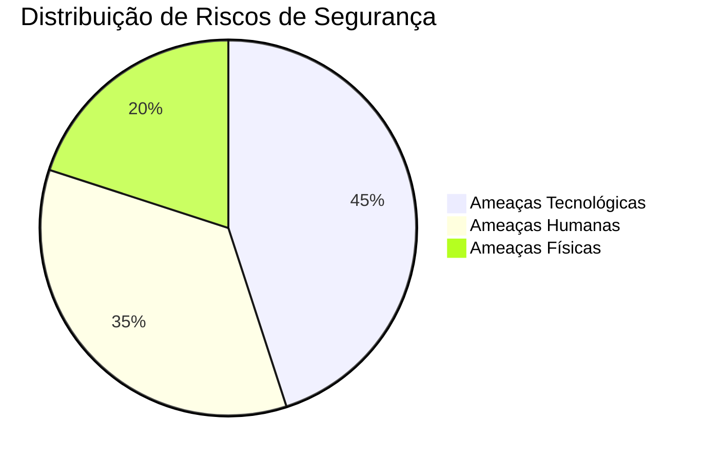

# 🔐 Diretriz de Política de Segurança da Informação (PSI)

## 📌 Sobre o Projeto

Neste trabalho assumo o papel de **Gestor de TI** da organização fictícia **ServiceOrder Tech**, uma empresa especializada no desenvolvimento de sistemas de gestão empresarial.

O objetivo desta **Política de Segurança da Informação (PSI)** é estabelecer normas e diretrizes que protejam os ativos da organização contra:

* ameaças **físicas**
* ameaças **tecnológicas**
* ameaças **humanas**

A política é fundamentada na **Tríade da Segurança da Informação**:

| Pilar                | Descrição                                                   |
| -------------------- | ----------------------------------------------------------- |
| 🔒 Confidencialidade | Apenas pessoas autorizadas podem acessar as informações     |
| 🧾 Integridade       | As informações não podem ser alteradas indevidamente        |
| ⚡ Disponibilidade    | Sistemas e dados devem estar disponíveis quando necessários |

---

# 📑 Sumário

* [1. Tipo de Organização](#1-tipo-de-organização)
* [2. Locais Críticos Protegidos](#2-locais-críticos-protegidos)
* [3. Governança de Segurança da Informação](#3-governança-de-segurança-da-informação)
* [4. Análise de Riscos](#4-análise-de-riscos)
* [5. Controles de Segurança](#5-controles-de-segurança)
* [6. Plano de Continuidade e Contingência](#6-plano-de-continuidade-e-contingência)
* [7. Regras de Conduta para Colaboradores](#7-regras-de-conduta-para-colaboradores)
* [8. Consequências pelo Descumprimento](#8-consequências-pelo-descumprimento)
* [9. Objetivo da Implantação da Política](#9-objetivo-da-implantação-da-política)
* [10. Vídeo de Apresentação](#10-vídeo-de-apresentação)

---

# 🏢 1. Tipo de Organização

A organização escolhida para esta atividade é a **ServiceOrder Tech**, uma empresa de tecnologia especializada no desenvolvimento de soluções de software para gestão empresarial.

### Principais serviços

* Sistemas de **ordens de serviço**
* Sistemas de **gestão empresarial**
* Sistemas **financeiros**
* Aplicações **web corporativas**

### Infraestrutura utilizada

* servidores de aplicação
* banco de dados corporativo
* infraestrutura de rede
* repositórios de código

---

# 📍 2. Locais Críticos Protegidos

## 🖥 Data Center / Servidores

Ambiente responsável por hospedar:

* banco de dados
* sistemas da empresa
* aplicações web

Medidas de segurança:

* controle de acesso físico
* monitoramento por câmeras
* nobreak
* controle de temperatura

---

## 🏢 Escritório Administrativo

Contém equipamentos e documentos sensíveis.

Principais riscos:

* roubo de equipamentos
* acesso indevido
* vazamento de informações

Medidas de proteção:

* controle de acesso
* bloqueio automático de computadores
* armazenamento seguro de documentos

---

## 🌐 Infraestrutura de Rede

Inclui:

* roteadores
* switches
* firewall
* VPN corporativa

---

# 👥 3. Governança de Segurança da Informação

A segurança da informação é responsabilidade de toda a organização.

## 👨‍💻 Gestor de TI

Responsável por:

* definir políticas de segurança
* monitorar infraestrutura
* responder a incidentes de segurança

---

## ⚙ Administrador de Sistemas

Responsável por:

* gerenciamento de servidores
* execução de backups
* aplicação de atualizações

---

## 👨‍💼 Colaboradores

Devem:

* seguir as políticas de segurança
* proteger suas credenciais
* comunicar incidentes

---

# ⚠️ 4. Análise de Riscos

A análise de riscos identifica possíveis ameaças que podem comprometer os ativos da organização.

## Distribuição dos Tipos de Riscos



---

## 🔥 Ameaças Físicas

Exemplos:

* desastres naturais
* falhas elétricas
* incêndios

Mitigação:

* nobreak
* backup em nuvem
* plano de recuperação de desastres

---

## 💻 Ameaças Tecnológicas

Exemplos:

* ataques hackers
* malware
* ransomware
* indisponibilidade de sistemas

Mitigação:

* firewall
* antivírus
* atualizações de segurança
* monitoramento de rede

---

## 👤 Ameaças Humanas

Exemplos:

* erro humano
* negligência
* vazamento de dados

Mitigação:

* treinamento de segurança
* controle de permissões
* auditoria de acessos

---

# 🔐 5. Controles de Segurança

## Controle de Acesso

* login individual
* senha forte
* níveis de permissão por função

---

## Criptografia

* comunicação segura via **HTTPS**
* criptografia de dados sensíveis
* uso de **VPN**

---

## Backup

* backups **diários**
* armazenamento seguro
* testes de restauração

---

# 🚑 6. Plano de Continuidade e Contingência

Em caso de falha crítica:

1. ativação do plano de contingência
2. restauração do backup mais recente
3. redirecionamento para servidor de backup
4. comunicação com equipe

Objetivo: **restaurar serviços rapidamente e minimizar impactos**.

---

# 📋 7. Regras de Conduta para Colaboradores

Todos os colaboradores devem:

* não compartilhar senhas
* bloquear o computador ao se ausentar
* não instalar softwares não autorizados
* utilizar apenas sistemas aprovados
* reportar incidentes de segurança

---

# ⚖️ 8. Consequências pelo Descumprimento

O descumprimento das normas poderá resultar em:

* advertência
* suspensão
* demissão
* responsabilização legal

---

# 🎯 9. Objetivo da Implantação da Política

A política busca:

* proteger dados da empresa
* reduzir riscos operacionais
* garantir continuidade dos serviços
* fortalecer cultura de segurança

---

# 🎥 10. Vídeo de Apresentação

Para a demonstração do trabalho foi gravado um vídeo de até **5 minutos**, apresentando:

* organização escolhida
* análise de riscos
* controles de segurança
* justificativa da política

📎 Link do vídeo (YouTube não listado)

```
COLE_AQUI_O_LINK_DO_VIDEO
```

---

# ✅ Conclusão

A implementação da **Política de Segurança da Informação** fortalece a proteção dos ativos da organização e reduz vulnerabilidades.

A política é baseada nos três pilares fundamentais da segurança:

* **Confidencialidade**
* **Integridade**
* **Disponibilidade**
