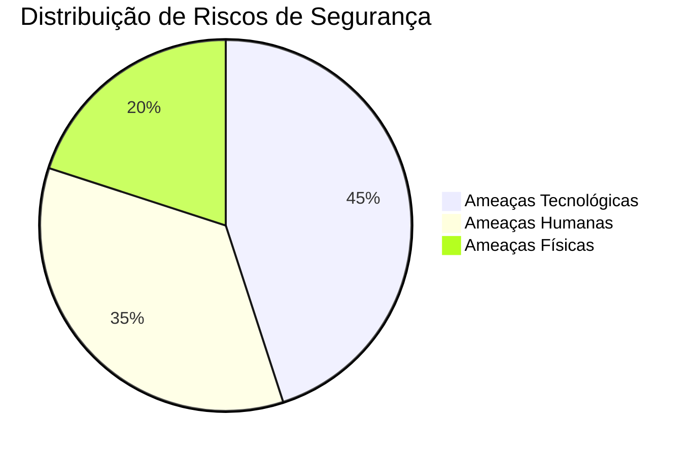

# 🔐 Diretriz de Política de Segurança da Informação (PSI)

## 📌 Sobre o Projeto

Neste trabalho assumo o papel de **Gestor de TI** da organização fictícia **ServiceOrder Tech**, uma empresa especializada no desenvolvimento de **sistemas de gestão empresarial**.

O objetivo desta **Política de Segurança da Informação (PSI)** é estabelecer **regras, diretrizes e controles** para proteger os ativos da organização contra ameaças que possam comprometer a segurança das informações.

A política busca garantir a proteção das informações com base na **Tríade da Segurança da Informação**:

| Pilar | Descrição |
|------|-----------|
| 🔒 **Confidencialidade** | Apenas pessoas autorizadas podem acessar as informações |
| 🧾 **Integridade** | As informações não podem ser alteradas indevidamente |
| ⚡ **Disponibilidade** | Sistemas e dados devem estar acessíveis quando necessários |

Essa política se aplica a **todos os colaboradores, gestores e usuários dos sistemas da organização**.

---

# 📑 Sumário

* [1. Tipo de Organização](#1-tipo-de-organização)
* [2. Locais Críticos Protegidos](#2-locais-críticos-protegidos)
* [3. Governança de Segurança da Informação](#3-governança-de-segurança-da-informação)
* [4. Análise de Riscos](#4-análise-de-riscos)
* [5. Regras e Aplicabilidade da Política](#5-regras-e-aplicabilidade-da-política)
* [6. Consequências pelo Descumprimento](#6-consequências-pelo-descumprimento)

---

# 🏢 1. Tipo de Organização

A organização escolhida para esta atividade é a **ServiceOrder Tech**, uma empresa fictícia do setor de **tecnologia da informação**, especializada no desenvolvimento de **sistemas corporativos**.

## Principais serviços oferecidos

A empresa desenvolve soluções como:

- sistemas de **ordens de serviço**
- sistemas de **gestão empresarial**
- sistemas **financeiros**
- aplicações **web corporativas**

## Infraestrutura utilizada

Para fornecer seus serviços, a empresa utiliza:

- servidores de aplicação
- banco de dados corporativo
- infraestrutura de rede interna
- repositórios de código e sistemas de versionamento

Esses recursos são considerados **ativos críticos da organização** e devem ser protegidos adequadamente.

---

# 📍 2. Locais Críticos Protegidos

Determinados ambientes da organização possuem **informações e recursos sensíveis**, sendo classificados como **locais críticos**.

## 🖥 Data Center / Servidores

Ambiente responsável por hospedar:

- banco de dados da empresa
- sistemas corporativos
- aplicações web

### Medidas de segurança

- controle de acesso físico restrito
- monitoramento por câmeras
- nobreak para proteção contra falhas elétricas
- controle de temperatura e ventilação

---

## 🏢 Escritório Administrativo

Local onde trabalham os colaboradores e onde estão presentes computadores e documentos importantes.

### Principais riscos

- roubo de equipamentos
- acesso não autorizado
- vazamento de informações

### Medidas de proteção

- controle de acesso ao ambiente
- bloqueio automático de computadores
- armazenamento seguro de documentos

---

## 🌐 Infraestrutura de Rede

A rede corporativa conecta todos os sistemas e equipamentos da empresa.

Ela inclui:

- roteadores
- switches
- firewall corporativo
- acesso remoto via VPN

Essa infraestrutura deve ser protegida para evitar **invasões e acessos indevidos**.

---

# 👥 3. Governança de Segurança da Informação

A segurança da informação é responsabilidade **de todos dentro da organização**, porém algumas funções possuem responsabilidades específicas.

## 👨‍💻 Gestor de TI

Responsável por:

- definir políticas de segurança
- monitorar a infraestrutura tecnológica
- responder a incidentes de segurança
- garantir a aplicação da política de segurança

---

## ⚙ Administrador de Sistemas

Responsável por:

- gerenciamento de servidores
- execução de backups
- aplicação de atualizações de segurança
- monitoramento de sistemas

---

## 👨‍💼 Colaboradores

Todos os colaboradores devem:

- seguir as normas da política de segurança
- proteger suas credenciais de acesso
- não compartilhar senhas
- comunicar incidentes de segurança

---

# ⚠️ 4. Análise de Riscos

A análise de riscos identifica **ameaças que podem comprometer a segurança das informações da organização**.

## Distribuição dos Tipos de Riscos

Esses riscos podem ser classificados em três categorias principais:

- **ameaças físicas**
- **ameaças tecnológicas**
- **ameaças humanas**

---

## 🔥 Ameaças Físicas

Exemplos:

- incêndios
- falhas elétricas
- desastres naturais

### Medidas de mitigação

- uso de nobreak
- backup em nuvem
- plano de recuperação de desastres

---

## 💻 Ameaças Tecnológicas

Exemplos:

- ataques de hackers
- malware
- ransomware
- falhas em sistemas

### Medidas de mitigação

- firewall corporativo
- antivírus
- atualizações de segurança
- monitoramento de rede

---

## 👤 Ameaças Humanas

Exemplos:

- erro humano
- negligência
- vazamento de dados
- uso indevido de sistemas

### Medidas de mitigação

- treinamento de segurança
- controle de permissões de acesso
- auditoria de acessos

---

# 📋 5. Regras e Aplicabilidade da Política

Esta política é **obrigatória para todos os colaboradores e usuários dos sistemas da empresa**.

Todos devem seguir as seguintes regras:

- não compartilhar senhas
- utilizar apenas sistemas autorizados
- bloquear o computador ao se ausentar
- não instalar softwares não autorizados
- respeitar as políticas de acesso aos sistemas
- reportar qualquer incidente de segurança

O descumprimento dessas regras compromete a **segurança da organização** e pode gerar penalidades.

---

# ⚖️ 6. Consequências pelo Descumprimento

O não cumprimento das normas estabelecidas nesta política poderá resultar em medidas disciplinares, como:

- advertência
- suspensão
- desligamento do colaborador
- responsabilização legal, dependendo da gravidade do incidente

Essas medidas visam garantir o **cumprimento das normas de segurança e a proteção dos ativos da organização**.

---

# 🎯 Conclusão

A implementação de uma **Política de Segurança da Informação** é fundamental para proteger os ativos digitais e físicos da organização.

Ao aplicar regras claras e boas práticas de segurança, a empresa consegue:

- reduzir riscos
- proteger informações sensíveis
- garantir continuidade dos serviços
- fortalecer a cultura de segurança da informação

Assim, a organização assegura que seus sistemas e dados estejam protegidos contra ameaças **físicas, tecnológicas e humanas**.
